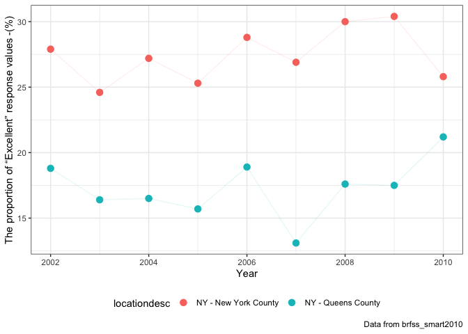

p8105\_hw2\_jl5297
================
Jun Lu
9/25/2018

Executive Summary
-----------------

This my second homework for Data Science, including my solutions to Problems 1, 2 and 3. And I was praciticing data wrangling and tidy data through this homework.

Load Packages
-------------

``` r
library(tidyverse)
library(readxl)
```

Problem 1
---------

### 1. Read and clean the data

Read and clean the NYC Transit data

``` r
nyc = 
    read_csv("./data/NYC_Transit_Subway_Entrance_And_Exit_Data.csv") %>% 
    janitor::clean_names() %>% 
    select(line:entry, vending, ada) %>% 
    mutate(entry = ifelse(entry == "YES", T, F))

nyc
```

    ## # A tibble: 1,868 x 19
    ##    line     station_name station_latitude station_longitude route1 route2
    ##    <chr>    <chr>                   <dbl>             <dbl> <chr>  <chr> 
    ##  1 4 Avenue 25th St                  40.7             -74.0 R      <NA>  
    ##  2 4 Avenue 25th St                  40.7             -74.0 R      <NA>  
    ##  3 4 Avenue 36th St                  40.7             -74.0 N      R     
    ##  4 4 Avenue 36th St                  40.7             -74.0 N      R     
    ##  5 4 Avenue 36th St                  40.7             -74.0 N      R     
    ##  6 4 Avenue 45th St                  40.6             -74.0 R      <NA>  
    ##  7 4 Avenue 45th St                  40.6             -74.0 R      <NA>  
    ##  8 4 Avenue 45th St                  40.6             -74.0 R      <NA>  
    ##  9 4 Avenue 45th St                  40.6             -74.0 R      <NA>  
    ## 10 4 Avenue 53rd St                  40.6             -74.0 R      <NA>  
    ## # ... with 1,858 more rows, and 13 more variables: route3 <chr>,
    ## #   route4 <chr>, route5 <chr>, route6 <chr>, route7 <chr>, route8 <int>,
    ## #   route9 <int>, route10 <int>, route11 <int>, entrance_type <chr>,
    ## #   entry <lgl>, vending <chr>, ada <lgl>

The "nyc\_transit" dataset extracted data from "NYC\_Transit\_Subway\_Entrance\_And\_Exit\_Data.csv" document. This dataset has 1868 rows and 19 columns. There are 1868 observations in this dataset. The nyc\_transit dataset contains variables including line, station, name, station latitude / longitude, routes served, entry, vending, entrance type, and ADA compliance.

I load the data, clean the varibales name, select needed variables and convert the entry variable from character (YES vs NO) to a logical variable. These data are not tidy, because there are variables value in columns' names. And I think it should add a column to tell which entrance it is because it is quite confusing now.

### 2. Solution to questions

**a. Count distinct stations**

``` r
nyc_distinct = distinct(nyc[c("line", "station_name", "ada")])
nrow(nyc_distinct)
```

    ## [1] 465

There are 465 distinct stations.

**b. Count stations which are ADA compliant**

``` r
nyc_distinct %>% filter(ada == T) %>% nrow()
```

    ## [1] 84

There are 84 stations which are ADA compliant.

**c. Calculate proportion of station entrances / exits without vending allow entrance**

``` r
entran_withoutvending = nyc %>% filter(vending == "NO")
mean(entran_withoutvending$entry)
```

    ## [1] 0.3770492

The proportion of station entrances / exits without vending allow entrance is about 0.377.

### 3. Reform data

Reformat data so that route number and route name are distinct variables. After reforming, I delete the line with NA in route name to make this dataset more tidy.

``` r
nyc_reform = nyc %>% 
    gather(key = route_number, value = route_name, route1:route11) %>% 
    select(line, station_name, route_number, route_name, ada, everything()) %>%
    filter(!is.na(route_name)) %>%  
    arrange(line, station_name)

nyc_reform
```

    ## # A tibble: 4,270 x 10
    ##    line     station_name route_number route_name ada   station_latitude
    ##    <chr>    <chr>        <chr>        <chr>      <lgl>            <dbl>
    ##  1 4 Avenue 25th St      route1       R          FALSE             40.7
    ##  2 4 Avenue 25th St      route1       R          FALSE             40.7
    ##  3 4 Avenue 36th St      route1       N          FALSE             40.7
    ##  4 4 Avenue 36th St      route1       N          FALSE             40.7
    ##  5 4 Avenue 36th St      route1       N          FALSE             40.7
    ##  6 4 Avenue 36th St      route2       R          FALSE             40.7
    ##  7 4 Avenue 36th St      route2       R          FALSE             40.7
    ##  8 4 Avenue 36th St      route2       R          FALSE             40.7
    ##  9 4 Avenue 45th St      route1       R          FALSE             40.6
    ## 10 4 Avenue 45th St      route1       R          FALSE             40.6
    ## # ... with 4,260 more rows, and 4 more variables: station_longitude <dbl>,
    ## #   entrance_type <chr>, entry <lgl>, vending <chr>

### 4. Solutions to questions

**a. Count distinct stations which serve the A train**

``` r
nyc_reform_distinct = distinct(nyc_reform[c("line", "station_name",  "route_name", "ada")])
nyc_reform_distinct %>% filter(route_name == "A") %>% nrow()
```

    ## [1] 60

There 60 distinct stations which serve the A train.

**b. Count how many distinct stations which serve the A train are ADA compliant**

``` r
nyc_reform_distinct %>% filter(route_name == "A", ada == T) %>% nrow()
```

    ## [1] 17

There are 17 distinct stations which serve the A train and are ADA compliant.

Problem 2
---------

### 1. Read and clean data

**a. Read and clean the Mr. Trash Wheel sheet.**

``` r
trash = read_excel("./data/HealthyHarborWaterWheelTotals2017-9-26.xlsx",
                   sheet = 1, range = cell_cols("A:N")) %>% 
    janitor::clean_names() %>% 
    rename(weight = weight_tons, volume = volume_cubic_yards) %>% 
    filter(!is.na(dumpster)) %>% 
    mutate(sports_balls = as.integer(round(sports_balls, 0)))

head(trash)
```

    ## # A tibble: 6 x 14
    ##   dumpster month  year date                weight volume plastic_bottles
    ##      <dbl> <chr> <dbl> <dttm>               <dbl>  <dbl>           <dbl>
    ## 1        1 May    2014 2014-05-16 00:00:00   4.31     18            1450
    ## 2        2 May    2014 2014-05-16 00:00:00   2.74     13            1120
    ## 3        3 May    2014 2014-05-16 00:00:00   3.45     15            2450
    ## 4        4 May    2014 2014-05-17 00:00:00   3.1      15            2380
    ## 5        5 May    2014 2014-05-17 00:00:00   4.06     18             980
    ## 6        6 May    2014 2014-05-20 00:00:00   2.71     13            1430
    ## # ... with 7 more variables: polystyrene <dbl>, cigarette_butts <dbl>,
    ## #   glass_bottles <dbl>, grocery_bags <dbl>, chip_bags <dbl>,
    ## #   sports_balls <int>, homes_powered <dbl>

**b. Read and clean precipitation data for 2017.**

``` r
precip_2017 = read_excel("./data/HealthyHarborWaterWheelTotals2017-9-26.xlsx",
                         sheet = 3, range = "A2:B14") %>%
    janitor::clean_names() %>% 
    rename(precipitation = total) %>% 
    filter(!is.na(precipitation)) %>% 
    mutate(year = "2017")
```

**c. Read and clean precipitation data for 2016.**

``` r
precip_2016 = read_excel("./data/HealthyHarborWaterWheelTotals2017-9-26.xlsx",
                         sheet = 4, range = "A2:B14") %>%
    janitor::clean_names() %>% 
    rename(precipitation = total) %>% 
    filter(!is.na(precipitation)) %>% 
    mutate(year = "2016")
```

**d. Combine datasets and convert month to a character variable**

``` r
precip = bind_rows(precip_2016, precip_2017) %>% 
    select(year, everything()) %>% 
    mutate(month = month.name[month])
head(precip)
```

    ## # A tibble: 6 x 3
    ##   year  month    precipitation
    ##   <chr> <chr>            <dbl>
    ## 1 2016  January           3.23
    ## 2 2016  February          5.32
    ## 3 2016  March             2.24
    ## 4 2016  April             1.78
    ## 5 2016  May               5.19
    ## 6 2016  June              3.2

### 2. Describe the data

The "trash"" dataset extracted data from sheet 1 of "HealthyHarborWaterWheelTotals2017-9-26.xlsx". It has 216 rows and 14 columns. There are 216 observations in this dataset(I include the 362th row as it has a dumpster number). And there are 14 variables in this dataset, including dumpster number, month, year, date, weight, volume, the number of a specific trash it collected and so on. For example, from the dataset we can know that on 2014-05-16 the dumpster 1 collected 1450 plastic bottles.

The "precip" dataset merged data from sheet 3 and sheet 4 of document "HealthyHarborWaterWheelTotals2017-9-26.xlsx". It has 20 rows and 3 columns. There are 20 observations and 3 variables including year, month and total precipitation in this dataset. For example, from the dataset we can know that on in January 2016 it collected 3.23 total precipitation.

### 3. Solutions to questions

**a. Total precipitation in 2017**

``` r
sum(precip_2017$precipitation)
```

    ## [1] 29.93

Total precipitation in 2017 is 29.93.

**b. The median number of sports balls in a dumpster in 2016**

``` r
trash %>% filter(year == "2016") %>% summarise(median(sports_balls))
```

    ## # A tibble: 1 x 1
    ##   `median(sports_balls)`
    ##                    <int>
    ## 1                     26

The median number of sports balls in a dumpster in 2016 is 26.

Problem 3
---------

### 1. Load the data

Need to install package p8105.datasets firstly on your computer.

``` r
library(p8105.datasets)
data("brfss_smart2010")
```

### 2. Clean the data

``` r
brfss_tidy = 
    brfss_smart2010 %>% 
    janitor::clean_names() %>%
    filter(topic == "Overall Health") %>% 
    select(-(class:question), -sample_size, -(confidence_limit_low:geo_location)) %>% 
    spread(key = response, value = data_value) %>% 
    janitor::clean_names() %>% 
    mutate(excellent_verygood_proportion = excellent + very_good) 
brfss_tidy
```

    ## # A tibble: 2,125 x 9
    ##     year locationabbr locationdesc   excellent  fair  good  poor very_good
    ##    <int> <chr>        <chr>              <dbl> <dbl> <dbl> <dbl>     <dbl>
    ##  1  2002 AK           AK - Anchorag…      27.9   8.6  23.8   5.9      33.7
    ##  2  2002 AL           AL - Jefferso…      18.5  12.1  32.7   5.9      30.9
    ##  3  2002 AR           AR - Pulaski …      24.1  12.5  29.9   4.2      29.3
    ##  4  2002 AZ           AZ - Maricopa…      21.6  10.3  26.9   4.6      36.6
    ##  5  2002 AZ           AZ - Pima Cou…      26.6   7.5  31.9   3.9      30.1
    ##  6  2002 CA           CA - Los Ange…      22.7  14.3  28.7   4.5      29.8
    ##  7  2002 CO           CO - Adams Co…      21.2  14.4  29     4.2      31.2
    ##  8  2002 CO           CO - Arapahoe…      25.5   8    29.3   2.1      35.2
    ##  9  2002 CO           CO - Denver C…      22.2  11.1  36.6   3        27.1
    ## 10  2002 CO           CO - Jefferso…      23.4  11.4  26.3   2.4      36.6
    ## # ... with 2,115 more rows, and 1 more variable:
    ## #   excellent_verygood_proportion <dbl>

### 3. Solutions to questions

**a. How many unique locations are included in the dataset? Is every state represented? What state is observed the most?**

``` r
# Calculate the number of unique locations
length(unique(brfss_tidy$locationdesc))
```

    ## [1] 404

``` r
# Find whether every state is represented
length(unique(brfss_tidy$locationabbr))
```

    ## [1] 51

``` r
# Find which state is observed the most
getmode <- function(v) {
   uniqv <- unique(v)
   uniqv[which.max(tabulate(match(v, uniqv)))]
}
getmode(brfss_tidy$locationabbr)
```

    ## [1] "NJ"

-   There are 404 unique locations
-   Every state is reprsented
-   NJ is observed most.

**b. In 2002, what is the median of the “Excellent” response value?**

``` r
brfss_tidy %>% 
    filter(year == "2002") %>% 
    summarise(median_2002 = median(excellent, na.rm = T))
```

    ## # A tibble: 1 x 1
    ##   median_2002
    ##         <dbl>
    ## 1        23.6

The median of the “Excellent” response value is 23.6.

**c. Make a histogram of “Excellent” response values in the year 2002**

``` r
brfss_tidy %>% 
    filter(year == 2002) %>% 
    ggplot(aes(x = excellent)) + 
    geom_histogram() +
    labs(
    title = "Histogram of “Excellent” response values in the year 2002",
    x = '"Excellent" response values',
    y = "Count",
    caption = "Data from brfss_smart2010") +
    theme_bw() 
```


``` r
ggsave("histogram.jpg")
```

**d. Make a scatterplot showing the proportion of “Excellent” response values in New York County and Queens County (both in NY State) in each year from 2002 to 2010.**

``` r
brfss_tidy %>% 
    filter(locationdesc %in% c("NY - New York County", "NY - Queens County")) %>% 
    ggplot(aes(x = year, y = excellent, color = locationdesc)) +
    geom_point(size = 3) + 
    geom_line(alpha = 0.1) +
    labs(
    x = "Year",
    y = "The proportion of “Excellent” response values -(%)",
    caption = "Data from brfss_smart2010") +
    theme_bw() +
    theme(legend.position = "bottom")
```



``` r
ggsave("scatterplot.jpg")
```

    ## Saving 7 x 5 in image
